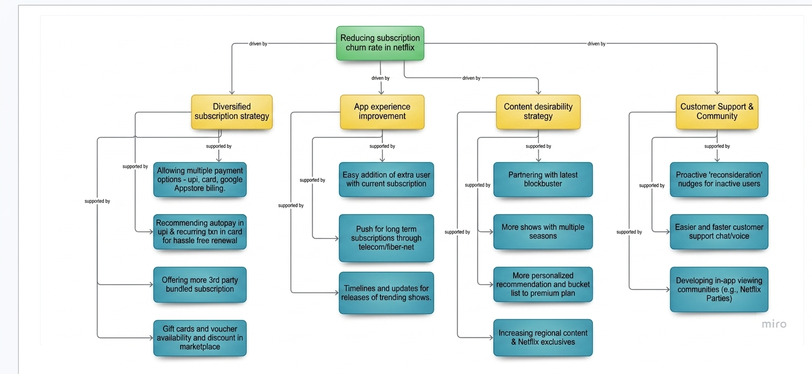

# Project -4 Business Acumen - Netflix Subscription Churn

## Problem

Netflix competes in a highly competitive subscription market where customer retention directly impacts long-term revenue growth. Subscription churn can occur due to multiple factors such as pricing concerns, content fatigue, weak personalization, increasing competition, low engagement, and reduced perceived value.

**Task:** Build a business-outcome mind map that identifies key churn drivers and connects them with product, content, pricing, and engagement solutions.

---

## Objective

Decompose the subscription churn problem into measurable causes and business outcomes, then map each cause to a practical product opportunity and the metric it can improve.

---

## Framework

**Business Outcome Mind Map** — A structured approach to breaking down a business problem (subscription churn) into key drivers, outcomes, and actionable levers.

---

## Approach

1. Defined the primary business outcome: reduce subscription churn and improve customer retention.
2. Categorized churn drivers into major areas:
   - Pricing
   - Content
   - Personalization
   - Engagement
   - Competition
   - Perceived value
3. Mapped each churn driver to relevant product, content, pricing, and engagement strategies.
4. Connected each strategy with measurable success metrics to evaluate impact.

---

## Key Insights

- Churn is a multi-dimensional problem — while pricing is often considered a major reason, content fatigue and poor personalization can silently reduce customer loyalty.
- Engagement acts as a leading indicator — declining watch frequency and reduced platform activity can predict churn before cancellation occurs.
- Perceived value is the bigger driver — improving content relevance and user experience can create more impact than simply reducing prices.

---

## Recommendations

- Improve personalization and content discovery to increase engagement and strengthen retention.
- Use engagement-based early warning signals to identify users at risk of churning.
- Introduce targeted retention strategies before users decide to cancel.
- Experiment with value-based offerings such as plans, bundles, and exclusive content instead of relying only on price reductions.

---

## Success Metrics

- Monthly churn rate
- Cohort retention rate
- Customer lifetime value (LTV)
- Watch frequency and time spent
- Reactivation rate
- Engagement score

---

## Business Impact *(Expected)*

Addressing high-impact churn drivers can improve customer retention, increase lifetime value, and strengthen long-term subscription revenue. Early identification of declining engagement patterns can help reduce voluntary churn through timely interventions.

<!-- Insert image here -->

