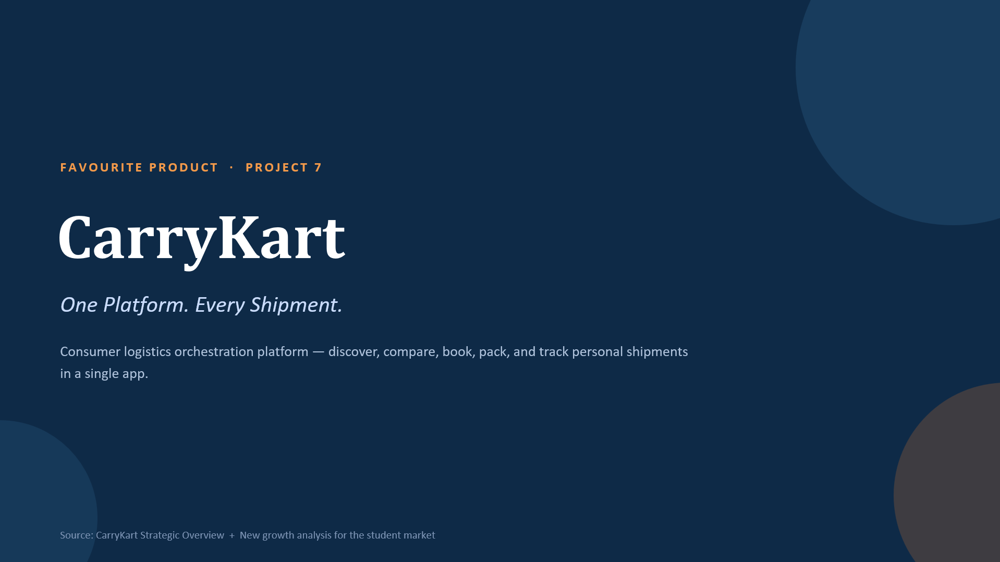

# CarryKart — Favourite Product

> **One Platform. Every Shipment.**
>
> **Favourite Feature:** Provider Comparison Tool  
> **Growth Focus:** Building CarryKart into the preferred logistics platform for college students

---

[](../../images/CarryKart_Favorite_Product_Deck.pptx)

> Click the preview to open the full presentation.
## 1. Product & Favourite Feature

### CarryKart

CarryKart is a **consumer-first logistics orchestration platform** that brings shipment discovery, comparison, booking, and tracking into one platform.

### ⭐ Favourite Feature: Provider Comparison Tool

The feature allows users to enter pickup and drop details **once** and compare multiple transport providers side-by-side.

| Parameter | What the user gets |
|---|---|
| 💰 Price | Compare transportation costs |
| ⏱️ ETA | Compare expected delivery time |
| ⭐ Rating | Compare provider reliability |
| 🚚 Provider | DTDC, India Post, Porter, Blue Dart, regional players |
| 🔎 Discovery | One search instead of multiple apps/calls |

### Why I like it

> **It converts a fragmented logistics search problem into a transparent, single-screen decision.**

**Before CarryKart**

`Search → Call Provider 1 → Call Provider 2 → Compare manually → Decide`

**With CarryKart**

`Enter details → Compare → Choose → Book`

---

## 2. Business Objective

### Core Objective

> **Increase booking conversion and transport commission revenue by reducing the trust and information gap at the point of provider selection.**

### Growth Flywheel

```text
Transparent Comparison
        ↓
Lower Trust Barrier
        ↓
Higher Search → Booking Conversion
        ↓
More Successful Shipments
        ↓
Higher Transport Commission
        ↓
More Provider Demand
        ↓
More Provider Onboarding
        ↓
Better Choice for Users

```
| Growth Pillar          | How Provider Comparison Helps                              |
|------------------------|-------------------------------------------------------------|
| **Customer Growth**    | Less friction → higher first-booking completion             |
| **Marketplace Growth** | More provider visibility → incentive for providers to join  |
| **Revenue Growth**     | Higher conversion → more transport & featured-listing commissions |

## 3. Target Users & Persona

### CarryKart User Types

| User Type | Key Need |
|---|---|
| 🎓 **College Students** | Hostel ↔ Home / Internship relocation |
| 💼 **Working Professionals** | City / job relocation |
| 🏠 **Independent Households** | Personal shipments |
| 👨‍👩‍👧 **Families** | Household movement |
| 🏢 **Small Businesses** | Goods transportation |

### 🎯 Selected Segment: College Students

#### Why Students?

- Frequent relocation
- Budget-conscious
- High logistics demand
- Limited access to personal transportation
- Strong peer networks
- Large underserved user base

---

### 👤 Persona: Rahul Sharma

| Attribute | Details |
|---|---|
| **Age** | 22 |
| **Profile** | Final-year engineering student |
| **Situation** | Moving out of hostel after graduation |
| **Items** | Books, clothes, electronics, bicycle |
| **Budget** | Highly price-sensitive |
| **Needs** | Affordable transport + doorstep pickup |
| **Trust Driver** | Ratings + transparent pricing |
| **Convenience Driver** | Live tracking |
| **Key Frustration** | Comparing multiple providers manually |

### Persona Need

> **“I want the cheapest reliable option without spending hours calling different transport providers.”**

## 4. Student Problem

### The Fragmented Status Quo

```text
Student realizes move is approaching
              ↓
Asks hostel WhatsApp groups
              ↓
Gets multiple provider recommendations
              ↓
Calls 2–3 providers individually
              ↓
Receives inconsistent quotes
              ↓
Searches for boxes + tape
              ↓
Books without reliable comparison
              ↓
Waits without visibility
              ↓
Pickup / delivery issues
              ↓
No unified support
```
## 5. Proposed Improvement — Student Move Mode

### 🚀 CarryKart Student Move

An enhanced version of the existing **Provider Comparison Tool** designed specifically around the student relocation journey.

### From:

> **“Here are 5 providers. Choose one.”**

### To:

> **“Here is the best option for your specific student move.”**

---

### Proposed Experience

```text
Semester / Graduation Move Detected
              ↓
Student Tier Pricing
              ↓
Enter Items Once
              ↓
Compare Providers
              ↓
Recommended Student Bundle
              ↓
Packaging + Optional Packer
              ↓
Group Discount Detection
              ↓
Book Around Class Schedule
              ↓
Live Tracking
              ↓
Automated Notifications
              ↓
Referral → Next Student
```
## 6. Key Product Features

### ① Smart Provider Comparison

> **Don't rank providers only by price.**

Show students the factors that matter when choosing a logistics partner:

| Factor | Example |
|---|---|
| 💰 **Price** | ₹1,499 |
| ⭐ **Rating** | 4.7/5 |
| ⏱️ **ETA** | 2–3 days |
| 📦 **Packaging** | Included |
| 🚚 **Pickup Reliability** | 98% |
| 🛡️ **Insurance** | Available |

---

### ② Recommended Student Bundle

Instead of forcing students to build the shipment themselves:

> **🎓 Recommended for Your Hostel Move**

- 🚚 Transport
- 📦 Packaging kit
- 📦 Optional professional packing
- 🏠 Doorstep pickup
- 📍 Live tracking

**Goal:** Move from *“Which provider should I choose?”* to *“Which recommended package is best for me?”*

---

### ③ Student Tier

#### Verify using:

- 🎓 College ID
- 📧 College email

#### Unlock:

> **🎓 Student Pricing**

This creates a differentiated offer for the student segment while also enabling CarryKart to verify genuine students.

---

### ④ Hostel Group Discount

If multiple students from the **same hostel/floor** are moving during the same week:

| Group Size | Proposed Benefit |
|---|---|
| **3 Students** | 5% off |
| **5 Students** | 8% off |
| **10+ Students** | Custom group rate |

> *Final discount levels to be validated during the pilot.*

### Why it works

**More students booking together → Better shipment economics → Lower effective cost per student**

---

### ⑤ Campus Ambassador Program

Turn students into a **campus-level acquisition channel**.

```text
Student books with CarryKart
            ↓
Shares referral with hostel-mates
            ↓
Friend completes shipment
            ↓
Both receive CarryKart credit
            ↓
More students join CarryKart
```

## 7. MVP Scope

### 🎯 Pilot: 3–5 Colleges in One City

### In Scope

| Feature | MVP? |
|---|:---:|
| Provider comparison | ✅ |
| Reliability-first ranking | ✅ |
| Student verification | ✅ |
| Student Tier pricing | ✅ |
| Hostel-move bundles | ✅ |
| One-tap packaging add-on | ✅ |
| Semester-calendar notifications | ✅ |
| Same-hostel group discounts | ✅ |
| Campus ambassador program | ✅ |
| Live tracking | ✅ |

### Out of Scope for MVP

| Feature | Phase |
|---|---|
| Full Leo Research Mode AI | V2 |
| Cross-city pooled logistics | Later |
| Subscription | Later |
| Insurance product | Later-stage revenue lever |

### MVP Philosophy

> **Validate the comparison → bundling → group booking → referral loop before investing in advanced AI.**
## 9. Competitive Comparison

| Feature | CarryKart | Porter | Generic Packers & Movers | WhatsApp / Local Contacts |
|---|:---:|:---:|:---:|:---:|
| Cross-provider comparison | ✅ | ❌ | Limited | ❌ |
| Price comparison | ✅ | Within own offering | Manual quotes | ❌ |
| ETA comparison | ✅ | Within own offering | Inconsistent | ❌ |
| Ratings / trust signals | ✅ | ✅ | Limited | ❌ |
| Doorstep pickup | ✅ | ✅ | ✅ | Varies |
| Live tracking | ✅ | ✅ | Varies | ❌ |
| Packaging add-on | ✅ | Limited | Sometimes | ❌ |
| Student pricing | **Opportunity** | ❌ | ❌ | ❌ |
| Hostel bundles | **Opportunity** | ❌ | ❌ | ❌ |
| Group booking | **Opportunity** | ❌ | ❌ | ❌ |
| Campus referral loop | **Opportunity** | ❌ | ❌ | ❌ |

### 🎯 Competitive White Space

> **CarryKart can move from being a logistics aggregator to becoming the student's end-to-end relocation companion.**

## 10. Success Metrics

### ⭐ North Star Metric

> **Successful Goods Deliveries per Active User**

### Student-Segment Metrics

| Funnel Stage | KPI |
|---|---|
| **Acquisition** | Campuses penetrated |
| | Sign-ups per campus |
| | Student verification rate |
| **Activation** | % users activated around semester dates |
| **Conversion** | Comparison → booking conversion |
| | Search → booking conversion |
| | Bundle attach rate |
| **Retention** | Repeat bookings/student/year |
| | Referral-driven sign-ups |
| **Delivery** | Pickup success rate |
| | On-time delivery rate |
| | Damage/loss rate |
| **Revenue** | Average order value |
| | Commission per campus |
| | Subsidy cost vs. LTV |

---

## 11. Risks & Guardrails

| Risk | Guardrail |
|---|---|
| 📈 **Semester spike overwhelms providers** | Pre-negotiate surge capacity |
| 🎓 **Student discount abuse** | College ID/email verification |
| 📦 **Damage/loss on mixed-item shipments** | Pickup/drop photo documentation |
| 🧰 **Packaging quality inconsistency** | Vetted + rated packaging partners |
| 🎁 **Referral program gaming** | Credit only after successful delivery |
| 💰 **Thin margins on small student orders** | Cross-sell packaging + packing services |

---

# 12. Final Recommendation

## 🎯 Start with Comparison. Win with Bundling. Scale through Campuses.

### Phase 1 — Build Trust

Strengthen the existing **Provider Comparison Tool**:

> **Price + ETA + Rating + Reliability**

↓

### Phase 2 — Increase Basket Size

Introduce:

> **Student Tier + Hostel Bundles + Packaging + Packing**

↓

### Phase 3 — Create Network Effects

Launch:

> **Campus Ambassadors + Group Booking + Referral Credits**

↓

### Phase 4 — Add Intelligence

Introduce:

> **Leo Research Mode / AI-assisted recommendations**

---

## Growth Strategy

```text
                         CARRYKART
                             │
                  Provider Comparison
                             │
                       Builds Trust
                             │
                  Student Tier Pricing
                             │
                  Student Move Bundle
                             │
                  Hostel Group Booking
                             │
                   Campus Ambassador
                             │
                         Referrals
                             │
              ┌──────────────┴──────────────┐
              ↓                             ↓
       More Students                  More Shipments
              ↓                             ↓
              └───────────┬─────────────────┘
                          ↓
                 Higher Retention
                          +
                    Higher Revenue
```
## Final Takeaway

> ### 🎯 Don't acquire students one-by-one. Acquire the campus.

Students are a uniquely attractive segment because their logistics needs are:

| Student Characteristic | Why It Matters for CarryKart |
|---|---|
| 📅 **Predictable** | Semester-end / graduation cycles |
| 🏫 **Dense** | Many students move simultaneously |
| 💰 **Price-sensitive** | Provider comparison has high value |
| 🤝 **Social** | Referrals can spread quickly |
| 🔄 **Repeatable** | Home, internship, semester break, graduation |

---

### My Recommendation

```text
Provider Comparison Tool
            ↓
      Build Trust
            ↓
Bundle the Entire Student Move
            ↓
Use Campus Networks
            ↓
     Drive Referrals
            ↓
     Acquire More Students
            ↓
       Repeat Shipments
```
